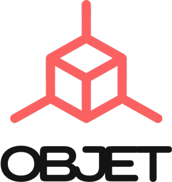

# (WIP) OBJET: A Graphics Playground for Computer Vision

Load your own objects in a room, take a snapshot of the viewport, from the view point of the customizable camera, and load it to python. This gives you the ability to creat data on-the-fly, in your python data loader. Check out [this video] by Ali Eslami et al. to see such environment in practice.

## Dependencies
On Arch linux
```
sudo pacman -S mesa glfw-x11 glew assimp swig freeimage
```

## Usage
```bash 
make python
```
```python
from OBJET import OBJET
```
[this video]: https://www.youtube.com/watch?v=G-kWNQJ4idw
