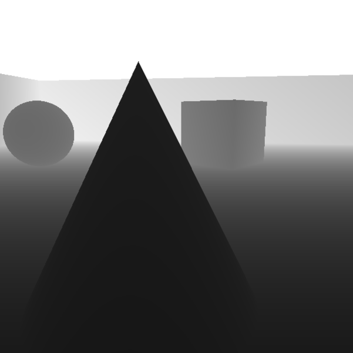

# OBJET: A Graphics Playground for Computer Vision
OBJET, is a graphical environment, developed in OpenGL and accessible in Python, to cater to the data needs of one willing to conduct research on computer vision in such domains. 


Load your own objects in a room, take a snapshot of the viewport, from the viewpoint of the customizable camera, and load it to python. 
This gives you the ability to create data on-the-fly, in your python data loader. 
Check out the footnoted video by Ali Eslami et al. to see such environment in practice.

## Synopsis

### Dependencies
On Arch Linux:
```
sudo pacman -S rapidjson mesa glfw-x11 glew glm assimp swig freeimage
```

### Usage

#### Build and Install
```sh 
make python -j4
pip install .
```

#### get_image
 
```python
# for now
from pyobjet import Objet
objet = Objet("./configs/ps_meta.json")
objet.set_object_position("cross", [3., 0., 3.])
objet.draw()
image = objet.get_image()
objet.to_image("./output.png")
```

#### get_depth_map
 
```python
# for now
depth_map = objet.get_depth_map()
# for demonstration
from PIL import Image
img = Image.fromarray(depth_map * 10)
img.show()
```


##### What does "OBJET" mean?
Objet is French for "object."

##### Are you French?
No, I used Google Translate.

##### Why C++/SWIG and not PyOpenGL?
* PyOpenGL is an overkill by nature. 
* Might be interested in using this library in other languages.
* Might be interested in linking the data directly to CUDA later on.
* Data Scientists should learn to install dependencies on their own — life ain't always `pip install package`.
* This work has been done over a COVID-19 quarantine, I had to kill some time.

###### Ali Eslami et al.: www.youtube.com/watch?v=G-kWNQJ4idw
